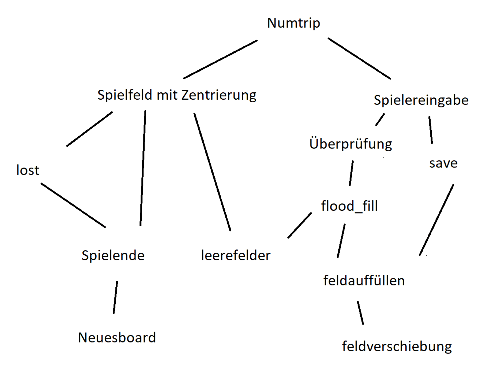

# Numtrip Blog

## Ziel des Spiels
Numtrip ist ein Denkspiel das ähnlichkeiten dem sehr populären Spiel 2048 hat. Das Feld besteht auf gleich viel Reihen und Zeilen. Die Felder sind gefüllt zufälligen geraden Zahlen. Man kann ein Feld auswählen, wenn ein anligendes Feld mit der selben Zahl gefüllt werden diese und die mit diesem Feld anliegende Verbunden. Das ausgewählte feld wird verdoppelt. Das ganze geht so bis man 1024 erreicht hat.
## Umsetzung des Spiels
**Vorraussetzungen**  
Um Numtrip spielen zu können braucht man Python, ich habe Visual Studio Code verwendet. Den Code findet man auf meinem Github  
https://github.com/Gerhard-69/EF-Informatik/blob/main/docs/Numtrip/game.py

**Top-Down-Entwurf**  
Mein aktualisierter Tod-Down Entwurf sieht so aus:



**Meine lost Definition**  
_lost()_ ist meine definition um zu überprüfen ob noch ein Spielzug möglich ist.
```py  
    global loss
```
als erstes bestimme ich das sich die definition den globalen Scope von der Variabel loss verändern soll. Dies mache ich, da ich das Beenden des Spieles in einer anderen Definition mache.

```py
    'for i in range(5):'
        old = board[x][y]
        if x > 0:
            if board[x-1][y] != old:
                loss = loss + 1
        if y < 4:
            if board[x][y+1] != old:
                loss = loss + 1
        if x > 0:
            if board[x-1][y] == old:
                loss = 0
                return
        if y < 4:
            if board[x][y+1] == old:
                loss = 0
                return
        'x = x-1'
```
Die orangenen Zeilen sind dafür verantwortlich damit man die Zeilen von unten nach oben sprich von 5 bis 1 durchgeht. 

Die anderen Zeilen sind zum zählen der nicht möglichen Spielzüge oder der möglichen Spielzüge. Wenn ich Spielzug möglich ist breche ich die Definition ab weil einer schon reicht um weiterspielen zu können.  

die old variable merkt sich den Wert in der Zelle die ich gerade überprüfe.  

Einen Trick den ich noch verwende ist, dass ich nur die Zellen über und rechts neben mir anschaue. Das mache ich da ich von links nach rechts also von Reihe 1 nach 5 das Feld überprüfe.

```py
    x = 4
    y = y+1
    lost(x, y)
```
hier setze ich die Zeile wieder auf den "Normalwert" und gehe in die nächste Reihe. Zum Schluss noch eine Rekursion und schon ist die ganze Definition fertig

## Grösste Herrausforderung  
Ich bin beim Programmieren sehr oft auf Probleme gestossen die ich mal mehr mal weniger elegant gelöst habe. Ein Problem auf das ich immer wieder gestossen bin hat sich in meiner feldverschiebung definition abgespielt. Diese hat zwar immer funktioniert aber nie ganz, da ich nie smart genug war mehrere senarien zu testen und sie dann nur für einen speziellen Fall funktioniert hat. Also musste ich immer wieder zu der Definition zurückkehren um mir erneut gedanken dazu zu machen. Ein Beispiel ist das Bedenken von mehreren übereinander liegenden Feldern. Dass sowas passieren kann ist mir während dem Spielen aufgefallen also musste ich erstmal den Übeltäter ausfindig machen. Als sich dann wie so oft die Feldverschiebung als Problemkind herrausstellte habe ich mich zusätzlich noch sehr dumm beim lösen des Problems angestellt. Nach viel Zeit hab ich eine gefunden die sich aber nicht wirklich als platzsparend herrausgestellt hat.

## Tipps
Mein Tipp an andere EF-Schüler. Macht euch Notizen zum Code. Hätte ich dass von Anfang an gemacht wäre mir einiges an Zeit erspart geblieben da wenn mir ein Fehler in einer Definition aufgefallen ist, musste ich mir erstmal wieder den ganzen Code anschauen und verstehen welche Gedanken ich mir damals dazu gemacht habe.