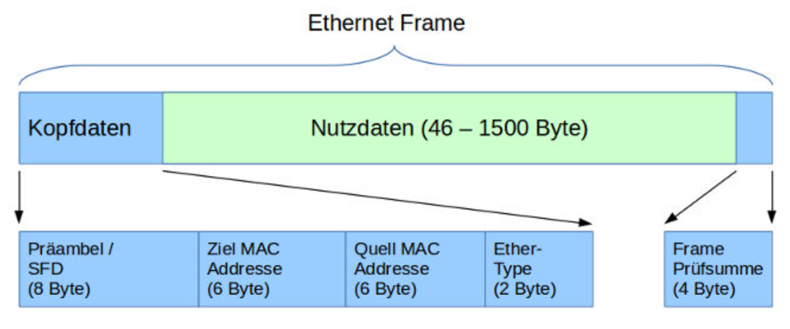

#  3. Vom Lan zum Internet
## Host
Host sind alle Geräte die Daten senden oder erhalten. Host ist in Client und Server aufgeteilt der Client schickt eine Anfrage an den Server. Ein Server kann aber auch als Client fungieren wenn er z.B ein Server Update macht. Dabei ist ein Server auch einfach nur ein Computer. 
## IP-Adressen    
Die IP-Adresse ist die Identität für jeden Host. Jede IP Adresse besteht aus 32 bits also aus 32 Nullen oder Einsen. Diese werden wiederum in Vier Teile geteilt also 8 bit gleich eine Zahl und Vier Zahlen gleich eine IP Adresse. Die grösste zahl ist 255 also 2^8-1 und die kleinste 0. Man kann mithilfe der IP-Adressen die Host zuordnen bzw. identifizieren. 
## Network   
Ein Network entsteht wenn mindestens zwei Hosts miteinander Verbunden sind. Das Network transpotiert die Daten von Host zu Host. Es können in einem Network andere Netzwerke bestehen die dann Subnets genannt werden. Jedes Network ist mit dem Internet (Interconnected Networks) verbunden.
## Repeaters
Ein Signal zwischen zwei Host kommt nicht an wenn diese zuweit auseinander sind, um dass zu verhindern gibt es Repeater die dazu da sind um das Signal zu erneuern.
## Hub
Ein Hub ist ein multi-port Repeater. Er ermöglicht es ein Signal, dass in den Hub reingeht wie ein Repeater zu erneuern gleichzeitig zu vermehrfachen und an alle anderen Hosts die mit dem Hub verbunden sind zu schicken.
## Bridge
Eine Bridge verbindet zwei Hosts. Sie lernen welche Hosts auf welcher Seite sind und können ein Signal auch nicht weiterleiten wenn sie wissen, dass das Signal nicht durch soll.   
## Switch
Ein Switch ist eine Kombination von einem Hub und einem Bridge.WDie die Bridge lernen sie welcher Host auf welchem Port ist und können so das Signal nur an den gewünschten Host weiterleiten, so ist man das Problem der Hubs los. Hosts in einem Network teilen die gleiche IP Adresse z.B 192.168.1.x ist bestimmt in dem Fall dann den Host.
## Router
Ein Router ermöglicht Kommunikation zwischen Netzwerken. Er ist mit dem Internet Verbunden. Er kann Daten überprüfen, filtern und umleiten. Router lernen mit welchen Netzwerken sie verbunden sind. Sie haben in jedem Network in dem sie sind eine IP-Adresse die in dem Network als Gateway dient. Das Internet besteht aus ganz vielen Routern wenn eine Datei von New York nach Tokio möchte dann muss sie durch Router im Internet.
## Bonus
Routing is the process of moving data between networks   
a Router is routing 

Switching is the process of moving data within networks    
a Switch is switching

There are many other Network Devices and all of them perform switching and/or routing.
# 4. IP-Adressen
## Netzwerkteil und Hostteil
IP-Adressen bestehen aus zwei Teilen.    
Vorderer Teil ist der Netzwerkteil und der hintere Teil ist der Hostteil.
## Netzmaske
Merksatz: Links von dieser Stelle hat es in der Netzmaske ausschliesslich 1, rechts davon hat es nur 0
```
Netzmaske:  255.255.254.0
IP-Adresse: 13.162.25.4

Binär:
Netzmaske:    1111 1111.1111 1111.1111 1110.0000 0000
IP-Adresse:   0000 1101.1010 0010.0001 1001.0000 0100
#             vvvv vvvv vvvv vvvv vvvv vvv
Netzwerkteil: 0000 1101.1010 0010.0001 100
#                                         v vvvv vvvv
Hostteil:                                 1.0000 0100
```
Ergänzt man den Netzwerkteil mit lauter 0 zu einer vollen 32 Bit langen IP-Adresse, so erhält man die Netzwerkadresse.
```
Netzwerkteil:                  0000'1101.1010'0010.0001'100
ergänzte Nullen:                                           0.0000.0000
resultierende Netzwerkadresse: 0000'1101.1010'0010.0001'1000.0000.0000 = 13.162.24.0
```
## Suffixnotation für Netzmaske
Um die Netzmaske zu erkennen muss man wissen wieviele einser sie hat. Die Anzahl der einsen kann man als Suffix bei einer IP-Adresse anhängen.
## Broadcastadresse
Broadcastadressen werden benötigt um ein IP-Paket an alle Geräte in einem Netzwerk zu schicken. Sie darf nicht als Adresse für ein Gerät verwendet werden.
## Spezielle IP-Adressen
**127.0.0.1** diese Adresse wird benötigt wenn ein Gerät sich ein IP-Paket an sich selber senden will.  
**0.0.0.0** diese Adresse steht nach Gerät für etwas anderes. "Ich habe noch keine IP-Adresse", "eine beliebige IP-Adresse" oder "aktuelles Netzwerk".
# 5-8   
## Mac-Adressen
Um Einsen und Nullen von einem Gerät zu einem anderen zu Transpotieren werden MAC-Adressen benötigt. Sie bestehen aus 48 bits die in 12 hex stellen dargestellt werden. 94-65-9C-3B-8A-E5 wäre z.B eine. Jeder NIC hat eine eigene MAC-Adresse.
## Gateway
ein Gateway ist die IP-Adresse von dem Router mit dem ein Gerät verbunden ist.
## ARP
ARP steht für Address Resolution Protocol und wird von hosts verwendet um die MAC Adresse von einem anderen host herrauszufinden. Das funktioniert in dem der host einen ARP request an alle hosts im Netzwerk sendet in der nach der IP-Adresse gefragt wird und die MAC-Adresse angefordet. Damit der host die MAC-Adresse zurückschicken kann sind im request die IP und MAC-Adresse angehängt. Wenn der host mit einem Router verbunden ist dann kann er den Router als Ziel angeben.
## MAC-Tabelle
Ein Switch erstellt eine MAC-Tabelle in der er sieht bei welchem Ausgang welche MAC-Adresse ist. Er lernt das in dem er nach einer erhaltenen Datei sich die Source MAC-Adresse merkt, mit der Zeit weiss er welche MAC-Adresse mit welchem Ausgang verbunden ist.
Bis er das weiss schickt er die Datei an alle host von denen er die MAC-Adresse nicht weiss.
## Ethernet-Frame

So sieht ein Ethernet-Frame aus der den Austausch von in einem Lan verbundenen Geräten darstellt. Die Bereiche haben folgende bedeutungen:   
**Präambel und Start Frame Delimitter (SFD)**     
Enthält keine Information, sondern nur abwechselnde auf 0 und 1 gesetzte Bits. Dadurch können sich die Empfänger auf die Übertragungsgeschwindigkeit des Senders einstellen.     
**Ziel-MAC-Adresse**     
Die lokale Adresse des Gerätes, an welches der Frame gerichtet ist.     
**Quell-MAC-Adresse**      
Die lokale Adresse des Gerätes, von welchem der Frame gesendet worden ist.    
**Ether-Type**      
Gibt an welches Protokoll in den Nutzdaten verwendet wird (also zum Beispiel IP).       
**Nutzdaten**      
Die eigentliche Nachricht. Im Falle des TCP/IP-Protokollstapels ein IP-Paket.    
**Frame Prüfsumme (Frame Check Sequence, FCS)**     
Wird vom Sender berechnet und erlaubt dem Empfänger zu überprüfen, ob der Frame korrekt übertragen und empfangen worden ist.
## Routing-Tabelle
Sie beschreibt eine Route wie ein Paket weitergeleitet werden kann und muss deswegen folgende Information enthalten. Das Routenziel, wenn das Ziel nicht im Netzwerk ist dann die IP-Adresse des Gateways und die Identifikation des Netzwerkadapters. Durch eine Metrik wird die beste Route entschieden. Die Route kann mehrere Ziele haben. Eine Host-Adresse, eine Netzwerk-Adresse oder die Standartroute. Um die Host- und Netzwerk-Adresse unterscheiden zu können wird die Netzmaske benötigt.